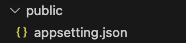

# Normal Flow(盒子模型)

各个元素的框的布局方式是将它们恰好具有的任何填充、边框或边距添加到其内容中（盒子模型）。   
默认情况下，块级元素的内容填充包含它的父元素的可用内联空间，并沿着块维度增长以容纳其内容。内联元素的大小就是其内容的大小。  

# 弹性盒（flex）

Flexbox 是一种一维布局方法，用于按行或列排列项目。弯曲（展开）以填充额外的空间或收缩以适应较小的空间`display:flex`
弹性模型   

-   flex-directionand flex-wrap:的简写形式 flex-flow,即`flex-direction: row; flex-wrap: wrap;`等价`flex-flow: row wrap;`

-   指定 Flex 值内的最小尺寸值，每个弹性项目将首先获得 x 的可用空间。之后，剩余的可用空间将根据比例单位共享。`flex: 1 xrem;`

-   更改 Flex 项目的布局顺序而不影响源顺序的功能（order）

    默认情况下，所有弹性项目 order 的值为 0。   
    具有较高 order 值的 Flex item 在显示顺序中将比具有较低 order 值的 item 晚出现。   
    具有相同 order 值的 Flex 商品将显示在其源 order 中。有四个 item，其顺序值分别设置为 2、1、1 和 0，则它们的显示顺序将为第 4、第 2、第 3、第 1。第三项出现在第二项之后，因为它具有相同的顺序值并且在源顺序中位于第二项之后。也可以设置负顺序值以使 item 早于值为 0 的 item 出现。

# 网格布局（grid）

CSS 网格布局是一种用于 Web 的二维布局，允许将内容布置在行和列中。   

-   使用属性 grid-template-areas 并为设计的各个元素命名，在网格上排列 item
    规则 grid-template-areas 如下：
    需要填充网格的每个单元格。
    要跨越两个单元格，重复该名称。
    要将单元格留空，使用.（句点）。
    区域必须是矩形的。
    区域不能在不同位置重复。

# Floats

1. 设置浮动：通过将元素的 float 属性设置为 left 或 right，使元素从正常的文档流中脱离，并向左或向右浮动。

2. 创建多列布局：通过设置多个元素的浮动属性，可以实现多列布局。每个列的宽度可以使用百分比或固定值来控制。

3. 图文混排：使用浮动布局可以将文本和图像元素进行混排，使它们按照指定的顺序排列。

4. 清除浮动：由于浮动元素脱离了文档流，可能会对其他元素的布局产生影响。为了避免这种问题，通常需要进行清除浮动（clearfix）的处理，以确保父容器正确包含浮动元素。

-   浮动布局可能导致父容器高度塌陷、布局错乱和元素重叠等问题，使用清除浮动、设置适当的宽度和使用 overflow: hidden 等技巧解决。

-   清除浮动元素并且不再出现在它旁边， `clear: left;`
    left：清除的项目向左浮动。
    right：清除项目向右浮动。
    both：清除左侧或右侧的所有浮动项目。

-   `display: flow-root;` 创建一个包含块（containing block）来包裹浮动元素，同时自动清除浮动。

# Position

# 多列布局（multicol）

具有`
`一类的容器会成为 multicol 容器。使用以下两个属性之一`multicol：column-count`或 `column-width`来多列布局。   
`column-count`属性将一个数字作为其值并创建该数量的列。   
`column-width`属性设置列宽   
`column-gap`属性更改列之间间隙的大小   
`column-rule`属性在列之间添加规则（` column-rule-color``column-rule-style``column-rule-width `的缩写）eg:`column-rule: width style color`    
`column-span`属性跨越多列的元素,不能使元素只跨越某些列。该属性只能具有值 none（这是默认值）或 all。    
`break-inside`属性用于指定在分页或列布局中是否允许元素内部发生分页断行或列断行。   

这个属性可以应用于块级元素，用于控制元素是否可以被分割到不同的页面或列中。   

-   由 multicol 创建的列不能单独设置样式。   
    1. 无法使一列比其他列更大   
    2. 无法更改单个列的背景或文本颜色   

# 响应式设计

响应式网页设计（RWD）是一种网页设计方法，使网页在所有屏幕尺寸和分辨率上都能良好呈现，同时确保良好的可用性。

媒体查询，默认情况下，多种布局方法（包括多列布局、Flexbox 和 Grid）都是响应式的
