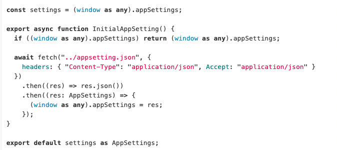

# fetch 封装

1. 在 public 文件夹内创建 appsetting.json。

2. 在.json写入需要存储和表示数据

```
{
  "serverUrl": "https://testapi.yamimeal.com",
  "jsVersion": "3.8.0",
  "sourceSystem": "web_customer",
  "languuagecode": "zh-TW"
}
```

3. 在 src 文件夹下创建 appsetting.ts,定义接口类型并将发起请求 json 的数据，将返回的结果定义给全局环境中 appSettings 对象

```
export interface AppSettings {
  serverUrl: string;
  jsVersion: string;
  sourceSystem: string;
  languagecode: string;
}

export const InitialAppSetting = async () => {
  if ((window as any).appSettings) return (window as any).appSettings;

  await fetch("../appsetting.json", {
    headers: { "Content-Type": "application/json", Accept: "application/json" },
  })
    .then((result) => result.json())
    .then((result: AppSettings) => ((window as any).appSettings = result));
};

```

4. 在 src 文件夹下创建 AppHook.ts，组件可以使用该 Hook 来判断数据是否加载完成，并根据 isLoad 状态进行相应的渲染处理

```
export const useAction = () => {
  const [isLoad, setIsLoad] = useState<boolean>(false);

  useEffect(() => {
    InitialAppSetting().then(() => setIsLoad(true));
  }, []);

  return { isLoad };
};

```

5. 在 App.tsx 中判断是否载入

```
export const App = () => {
  const { isLoad } = useAction();

  return isLoad ? <NavPage /> : <></>;
};

```

6. 创建 api 文件夹

7. 放入接口封装的方法

```
import { AppSettings } from "../appsettings";

export const Base = async <T>(
  url: string,
  method: "post" | "get",
  data?: object
) => {
  const settings = (window as any).appSettings as AppSettings;

  return await fetch(`${settings.serverUrl}${url}`, {
    method: method,
    body: data ? JSON.stringify(data) : undefined,
    headers: {
      js_version: settings.jsVersion,
      source_system: settings.sourceSystem,
      "Content-Type": "application/json",
    },
  })
    .then((result) => result.json())
    .then((result: T) => {
      return result;
    })
    .catch((err) => {
      console.log(err);
      throw new Error(err);
    });
};

export const Get = async <T>(url: string) => {
  return Base<T>(url, "get");
};

export const Post = async <T>(url: string, data?: object) => {
  return Base<T>(url, "post", data);
};
```

8. 封装需要调取数据的方法

```
export const GetCardListData = async (
  params: ICardApiProps
): Promise<ITxtCardData> => {
  return await Get(
    `/api/merch/list?limit=${params.limit}&page=${params.page}&deliveryType=${params.deliveryType}&lat=${params.lat}&lng=${params.lng}`
  );
};

export const GetSwiperImgData = async (
  data: UrlPostApiProps
): Promise<IUrlDataProps[]> => {
  return await Post("/api/Advertisement/advertisements", data);
};

```

9. 在 hook 中调用封装好的方法传入参数获取数据

```
  useEffect(() => {
    GetCardListData({
      limit: 10,
      page: 1,
      deliveryType: 1,
      lat: 37,
      lng: -121,
    })
      .then((data) => {
        const { restaurants } = data;
        data && data.restaurants.length && setCardData(restaurants);
      })
      .catch((err) => {
        console.error(err);
        throw new Error(err);
      });
  }, []);

  useEffect(() => {
    GetSwiperImgData({
      languageCode: setting.languagecode,
      latLang: latlng,
      pageLocation: 0,
    })
      .then((data) => {
        setUrlData(data);
      })
      .catch((err) => {
        console.error(err);
        throw new Error(err);
      });
  }, []);
```

## 在封装过程中遇到的问题

1. 关于 ts 中<T>泛型的使用

-   在更改 function 声明式为箭头函数时，在箭头函数中定义泛型与 function 声明式不同，所以在箭头函数中使用<T>定义泛型会报错
    导致这个问题原因：泛型语法与 JSX 的语法冲突，导致 TS 解析成 JSX 从而产生 unexpected token 的问题。  
    解决方法：
    1. <T>可以写在 .ts 文件下，但是不能写在 .tsx 文件下；
    2. 在<T>里加一个逗号写成<T，>；
    3. 在泛型参数上使用 extends 来提示编译器它是一个泛型 <T extends unknown>；

2. 没有挂载 InitialAppSetting 或者未挂载成功，会出现无法调用 appSettings 对象  
   解决办法：

    1. 挂载 InitialAppSetting 方法
    2. 挂载后判断是否 load 成功再显示页面

3. 关于全局环境中的 appSettings 对象
   在 appsetting.ts 中定义 setting 值，使用`import { AppSettings } from "../appsettings";`或者`import settings from "../appsettings";`会取不到在全局中定义好的 appSettings 对象情况，例如：
        
   此时：setting 的值为 undefined，在使用 setting 值时，调取不到 appsetting.json 存储的数据
   不能直接用 import 调取 setting 使用

    解决方法：  
     ` const settings = (window as any).appSettings as AppSettings;`，在需要使用 appsetting.json 存储的数据的位置定义并使用
