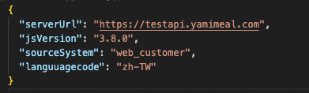
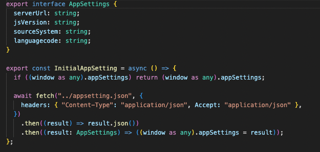
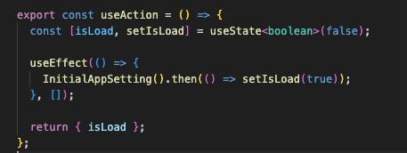
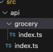
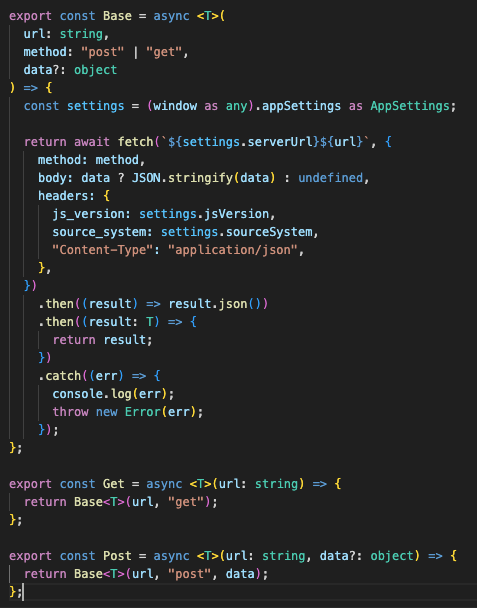
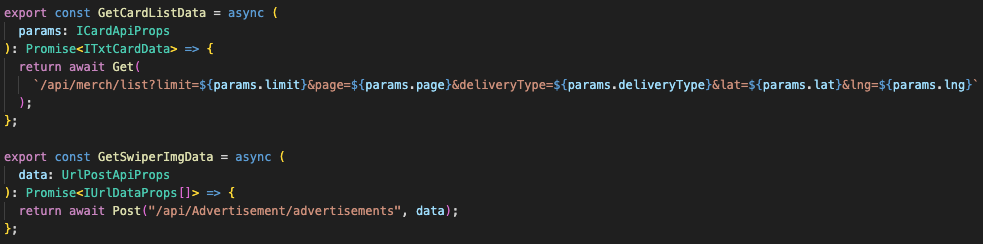
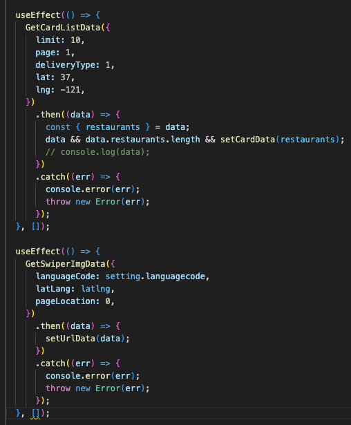

# fetch 封装

1. 在 public 文件夹内创建 appsetting.json
   

2. 写入需要存储和表示数据
   
3. 在 src 文件夹下创建 appsetting.ts,定义接口类型并将发起请求 json 的数据，将返回的结果定义给全局环境中 appSettings 对象
   
4. 在 src 文件夹下创建 AppHook.ts，用于挂载异步函数，并返回判断结果
   
5. 在 App.tsx 中判断是否载入
   
6. 创建 api 文件夹
   
7. 放入接口封装的方法
   
8. 封装需要调取数据的方法
   
9. 在 hook 中调用封装好的方法传入参数获取数据
   

## 在封装过程中遇到的问题

1. 关于 ts 中<T>泛型的使用

- 在更改 function 声明式为箭头函数时，在箭头函数中定义泛型与 function 声明式不同，所以在箭头函数中使用<T>定义泛型会报错
  导致这个问题原因：泛型语法与 JSX 的语法冲突，导致 TS 解析成 JSX 从而产生 unexpected token 的问题。
  解决方法：
  1. <T>可以写在 .ts 文件下，但是不能写在 .tsx 文件下；
  2. 在<T>里加一个逗号写成<T，>；
  3. 在泛型参数上使用 extends 来提示编译器它是一个泛型 <T extends unknown>；

2. 没有挂载 InitialAppSetting 或者未挂载成功，会出现无法调用 appSettings 对象
   解决办法：

   1. 挂载 InitialAppSetting 方法
   2. 挂载后判断是否 load 成功再显示页面

3. 关于全局环境中的 appSettings 对象
   在 appsetting.ts 中定义 setting 值，使用`import { AppSettings } from "../appsettings";`或者`import settings from "../appsettings";`会取不到在全局中定义好的 appSettings 对象情况，例如：
   
   此时：setting 的值为 undefined，在使用 setting 值时，调取不到 appsetting.json 存储的数据
   不能直接用 import 调取 setting 使用

   解决方法：
   ` const settings = (window as any).appSettings as AppSettings;`，在需要使用 appsetting.json 存储的数据的位置定义并使用
