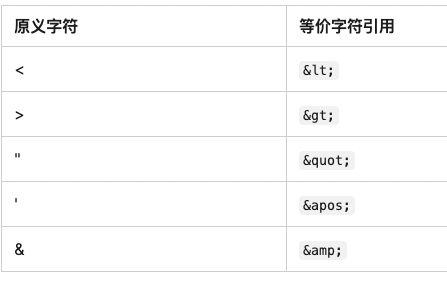
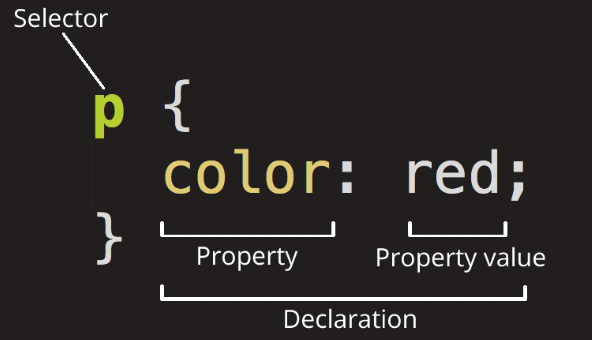
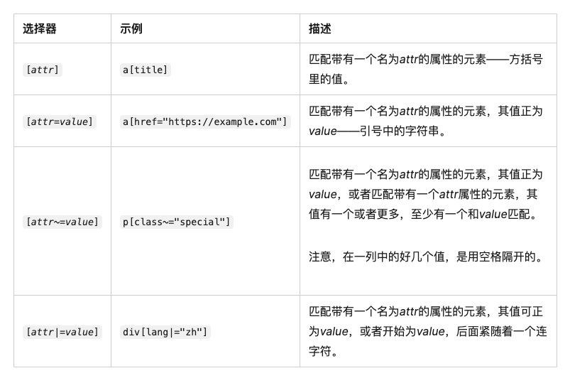
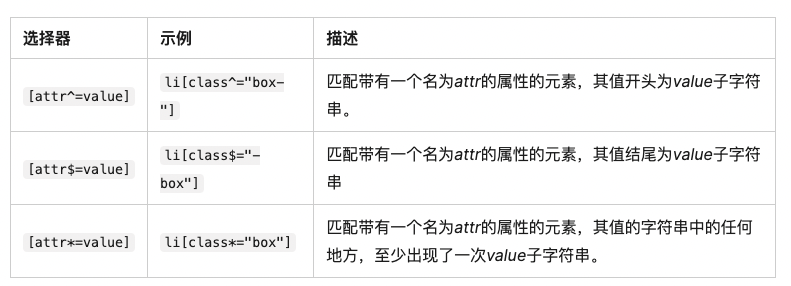
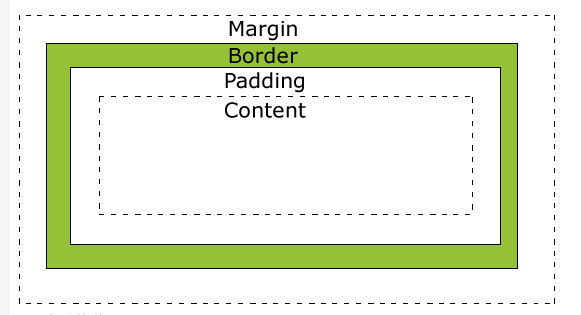

# React Hook

## useMemo

调用函数，缓存返回的结果  
在重新渲染之间，缓存返回结果，每次渲染都会和依赖项比较，直到依赖项发生变化  
useMemo 不会使得第一次渲染更快，只是帮助减少不必要的 update  
只能在顶层组件或者自己的 hook 中调用，不允许在循环和条件中调用  
参数 1: `()=>{}`  
参数 2： 依赖项  

```
useMemo(() => { },[dependency]);
```

## useCallback

不调用函数，缓存函数本身  
在重新渲染之间缓存函数定义，直到依赖项发生变化  
只能在顶层组件或者自己的 hook 中调用，不允许在循环和条件中调用  

```
useCallback(() => {Function() },[dependency]);
```

* 在函数式组件中函数会随着状态值的更新重新渲染,函数的定义函数会被频繁定义,在父子组件传参使用useCallback和useMemo结合可以减少子组件更新频率


## html

嵌套元素:将一个元素置于其他元素之中为嵌套  
空元素：不包含任何内容的元素称为空元素，这些元素只有一个标签，通常用来在此元素所在位置插入/嵌入东西  
列表：  

- 无序列表：用一个 ul 元素包围
- 有序列表：ol 元素包围
  链接
  `<a href="" / >`

#### 特殊字符




## css



### 选择器

- 标签选择器 所有指定类型的 HTML 元素 eg： p{} html{}
- id 选择器 一个元素只对应一个 ID eg: `<p id="id">` #id {}
- 类选择器 一个类可以对应多个实例 eg: `<p class="mystyle">` .mystyle{}
- 属性选择器 有特定的元素 eg： ` ` img[src]
- 伪类选择器 特定状态下的特定元素 eg: p:hover
- 全局选择器 是由一个星号`*`代指的，它选中了文档中的所有内容 eg：选中`<article>` 元素的任何第一子元素 `article  *:first-child {}`
- 存否和值选择器
  
- 子字符串匹配选择器
  
  tips：大小写敏感 在闭合括号之前，使用 i 值， eg：a[class^="a" i] {}

### calc()函数

calc()函数允许在 CSS 中进行简单的计算 eg：height: calc(100% - 3rem);

### Transform 函数

transform 属性允许旋转，缩放，倾斜或平移给定元素。通过修改 CSS 视觉格式化模型的坐标空间实现
transform 指定为关键字值 none 或一个或多个 <transform-function> 值

### 盒子模型

  
margin(外边距) - 清除边框外的区域，外边距是透明的。  
border(边框) - 围绕在内边距和内容外的边框。  
padding(内边距) - 清除内容周围的区域，内边距是透明的。  
content(内容) - 盒子的内容，显示文本和图像。  

### 样式

text-shadow/box-shadow ：水平偏移量 垂直偏移量 模糊半径 扩散半径 阴影基色；

### @规则

@import 将一个样式表导入另一个 CSS 样式表：  
@media，用来创建媒体查询。按照媒体查询使用条件逻辑来应用 CSS 样式。  

