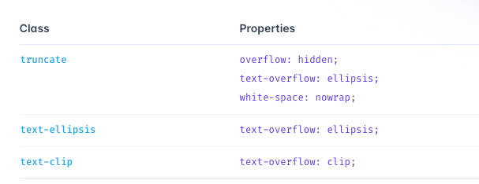

# 滚动条

````css
/* Hide scrollbar for IE, Edge and Firefox */
.no-scrollbar {
  -ms-overflow-style: none; /* IE and Edge */
  scrollbar-width: none; /* Firefox */
}
/* Hide scrollbar for Chrome, Safari and Opera */
.no-scrollbar::-webkit-scrollbar {
  display: none;
}
```

```css
/* 定义滚动条样式  */
::-webkit-scrollbar {
  width: 0.625rem;
  height: 0.3125rem;
}

/*定义滚动条轨道 内阴影+圆角*/
::-webkit-scrollbar-track {
  box-shadow: inset 0 0 0px rgba(240, 240, 240, 0.5);
  border-radius: 0.625rem;
  background-color: #f7f8fc;
}

/*定义滑块 内阴影+圆角*/
::-webkit-scrollbar-thumb {
  border-radius: 0.625rem;
  box-shadow: inset 0 0 0px rgba(240, 240, 240, 0.5);
  background-color: #c1cad8;
}
````

## 禁止拖拽

```css
.app-region {
  -webkit-app-region: drag;
}

.app-no-region {
  -webkit-app-region: no-drag;
}

.img-no-darg {
  -webkit-user-drag: none;
}
```

## 文本禁止选中

- tailwindcss 写法 select-none

```css
.no-user-select {
  -webkit-user-select: none; /* Safari */
  -ms-user-select: none; /* IE 10+ and Edge */
  user-select: none; /* Standard syntax */
}
```

## 文字溢出省略号

- tailwindcss 写法
  

```css
.myTeamSelect .ant-select-selection-item .myTeamSelectText {
  overflow: hidden;
  text-overflow: ellipsis;
  white-space: nowrap;
}
```
