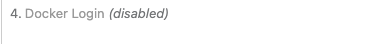

# CI 的卡位

## 考核项目 ci 卡位

### 报错位于 step3，找不到 package.json

在 package.json 中加入

```json
 "scripts": {
    "start": "react-scripts start",
    "build": "react-scripts build",
    "test": "react-scripts test",
    "eject": "react-scripts eject",
    "deploy": "npm run build" //加上这行代码
  }

```

### 报错在 step4 ，dockerfile 不生效

1. 在文件 find 目录下找到 dockerfile 文件，查看是否存在
2. 查看 dockerfile 文件名的拼写是否正确
3. 查看 dockerfile 文件内编写是否正确，可查看 dockerfile 文件字节数，对比一下
4. 找已生效的 dockerfile 文件，放在 finder 文件中，再打包查看是否生效

## SalesCaller.Web 卡位

### github 无权限问题导致

- 错误日志

```log
 Failed to perform checkout on agent: '/usr/bin/git -c core.askpass=/usr/local/TCAgent/temp/buildTmp/pass8264037977309932815 -c credential.helper= fetch --progress --recurse-submodules=no origin +refs/heads/*:refs/remotes/origin/*' command failed.
  exit code: 128
  stderr: fatal: unable to access 'https://github.com/sj-distributor/SalesCaller.Web/': Failed to connect to github.com port 443 after 75055 ms: Couldn't connect to server
```

```log
ERROR [09/13/23 10:26:22:50] An unexpected error occurred:
LibGit2Sharp.LibGit2SharpException: remote authentication required but no callback set
```

### yarn build 打包问题

现在本地打包 build 尝试，解决本地项目打包出现的问题

```shell
yarn bulid
```

### types/xlsx 卸载问题

- 错误日志

```log
warning @types/xlsx@0.0.36: This is a stub types definition for xlsx (https://github.com/sheetjs/js-xlsx). xlsx provides its own type definitions, so you don't need @types/xlsx installed!
error eslint-plugin-unicorn@47.0.0: The engine "node" is incompatible with this module. Expected version ">=16". Got "14.20.0"
error Found incompatible module.
```

```shell
yarn remove @types/xlsx
```

### eslint-plugin-unicorn 与 node.js 版本不兼容

- 错误日志

```log
error eslint-plugin-unicorn@47.0.0: The engine "node" is incompatible with this module. Expected version ">=16". Got "14.20.0"
error Found incompatible module.
```

```json
  "eslint-plugin-unicorn": "^47.0.0", // 需要node.js的版本在16以上
  "eslint-plugin-unicorn": "^42.0.0", // 可以兼容node.js的14版本
```

### docker login

- 错误日志

```log
WARNING! Using --password via the CLI is insecure. Use --password-stdin.
Error response from daemon: Get "https://yamimeal.azurecr.io/v2/": unauthorized: authentication required, visit https://aka.ms/acr/authorization for more information.
```

disable 掉 docker login 登陆步骤，代理机已经是 docker 登陆状态


### vite 找不到/build 路径

- 错误日志

```log
#7 ERROR: "/build" not found: not found
------
 > [2/4] COPY /build /usr/share/nginx/html:
------
failed to compute cache key: "/build" not found: not found
```

> 少了指定 build 的步骤
> CI 的 build 包是要识别到打包后的 build 包要在/build 路径下，vite 不指定的话 build 包是打包到其他名字的的

```ts
// vite.config.ts
build: { outDir: "build" },
```
