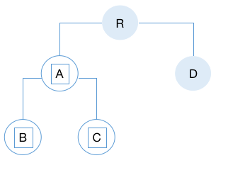
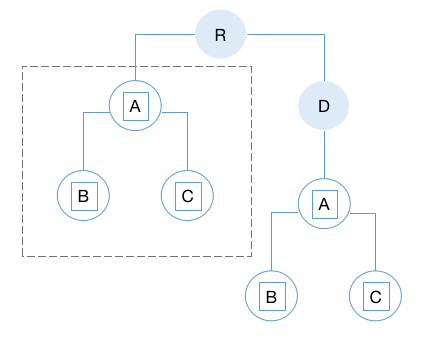

# React - Diff 算法

* 组件并不是真实的 DOM 节点，而是存在于内存之中的一种数据结构,虚拟 DOM，只有当它插入文档以后，才会变成真实的 DOM     
* React 的设计，所有的 DOM 变动，都先在虚拟 DOM 上发生，然后再将实际发生变动的部分，反映在真实 DOM 上，这种算法 DOM diff

## **Tree Diff (树差异)**
   React 只会对相同层级的 DOM 节点进行比较，即同一个父节点下的所有子节点，当发现节点已经不存在时，则该节点及其子节点会被完全删除掉，只对树进行一次遍历，便能完成整个 DOM 树的比较

   - 整个处理过程（ 对于不同层级的节点，只有创建和删除操作 ）
     假设 A 节点(包括其子节点)整个被移动到 D 节点下，当根节点发现子节点中 A 消失了，就会直接销毁 A;当 D 发现多了一个子节点 A，则会创建新的 A(包括子节点)作为其子节点
      
     **diff 的执行情况:** 创建 A → 创建 B → 创建 C → 删除 A
     
            

## **Component Diff (组件差异)**

- 同一类型的组件，按照原策略继续比较 Virtual DOM 树

- 如果不是，则将该组件判断为 dirty component，从而替换整个组件下的所有子节点

- 对于同一类型的组件，有可能其 Virtual DOM 没有任何变化，如果确切知道，可以节省大量的 diff 运算时间，React 允许用户通过 shouldComponentUpdate()来判断该组件是否需进行 diff 算法分析，如果调用了 forceUpdate 方法，shouldComponentUpdate 则失效

- 整个处理过程
  当组件 D 变为组件 G 时，即使这两个组件结构相似，一旦 React 判断 D 和 G 是不同类型的组件，不会比较二者的结构，而是直接删除组件 D，重新创建组件 G 及其子节点

## **Element Diff (元素差异)**

当节点处于同一层级时，diff 提供了 3 种节点操作

1. **INSERT_MARKUP（ 插入 ）**: 新的组件类型不在旧集合里，即全新的节点，需要对新节点执行插入操作

2. **MOVE_EXISTING （ 移动 ）**: 旧集合中有新组件类型，且 element 是可更新的类型，generateComponentChildren 已调用 receiveComponent ，这种情况下 prevChild=nextChild ，就需要做移动操作，可以复用以前的 DOM 节点

3. **REMOVE_NODE （ 删除 ）**: 旧组件类型，在新集合里也有，但对应的 element 不同则不能直接复用和更新，需要执行删除操作，或者旧组件不在新集合里的，也需要执行删除操作

- 整个处理过程

  旧的集合中包含节点 A、B、C 和 D
  新的集合中包含节点 B、A、D 和 C
  新旧集合 diff 差异化对比，则 B!=A，则创建并插入 B 至新集合，删除旧集合 A， 以此类推，创建并插入 A、D 和 C，删除 B、C 和 D

- 相同的节点，仅是位置发生了变化，需要进行繁杂低效的删除、创建操作，优化策略：允许对同一层级的同组子节点，添加唯一 key 进行区分

## 总结

- **Tree Diff**：用于比较虚拟 DOM 树之间的差异，以最小化实际 DOM 操作
- **Component Diff**：应用于组件级别，用于确定在组件更新时需要重新渲染的部分
- **Element Diff**：是树差异的一部分，用于比较单个元素的差异
