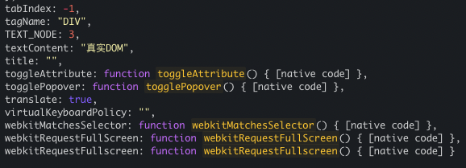

# 文档对象模型（DOM）

## 真实 DOM

- 浏览器将 HTML 或 XML 文档解析成树状结构的方式

- 每个 HTML 标签和它们的内容都被表示为一个节点，节点之间形成了层次结构

- JavaScript 可以通过操作这些节点来实现对文档的交互和操作, 动态地添加、删除、修改 HTML 元素，从而改变页面的外观和行为,每次对 DOM 进行更改时，浏览器都会重新计算并重新渲染整个页面，可能导致性能问题，特别是在大型和复杂的应用程序中

## 虚拟 DOM 的概念

React 引入的一个概念，旨在优化 DOM 操作，提高应用程序的性能和响应性

- **基本思想：** 在内存中构建一个轻量级的、虚拟的 DOM 树，与实际的 DOM 结构相对应,当数据发生变化时，先比较新旧虚拟 DOM 树的差异，然后只更新实际需要改变的部分，最终才将这些变化应用到实际的 DOM 中

- 通过比较变化生成最小化的 DOM 操作，优化性能、提升用户体验。在 React 中使用 JSX 语法描述虚拟 DOM，是关键概念

## 虚拟 DOM 和真实 DOM 的区别

- 两者结构对比

```ts
const VDOM = React.createElement("div", {}, "虚拟DOM");
const DOM = document.createElement("div");
DOM.innerHTML = "真实DOM";
console.log(`虚拟DOM：`, VDOM);
console.log(`真实DOM：`, DOM);
```

- 虚拟 DOM 是一个对象的结构

```ts
"虚拟DOM：", {
  $$typeof: [object Symbol] { ... },
  _owner: null,
  _store: { ... },
  key: null,
  props: {
    children: "虚拟DOM"
  },
  ref: null,
  type: "div"
}
```

- 真实的 DOM 是一个 dom 的结构

```ts
<div>真实DOM</div>
```

真实的 DOM 结构挂载了很多方法，其中一节截图：


## 虚拟 DOM 的好处

- **性能优化**：相对于直接操作实际 DOM，虚拟 DOM 的更新速度更快

- **减少重绘和回流**：更新策略可以最小化浏览器的重绘（repaint）和回流（reflow）操作，从而减少页面闪烁和性能瓶颈

- **简化复杂性**： 使得开发者可以更专注于应用程序的逻辑，帮助开发者更轻松地构建高性能的用户界面

### DOM 操作和重新渲染的性能问题可能会导致以下影响

1. **性能下降**：频繁的 DOM 操作和重新渲染会占用大量的 CPU 资源，导致页面响应变慢

2. **页面闪烁**：重新渲染可能导致页面的闪烁，因为在重新渲染期间，页面上的元素可能会短暂地消失或重新排列

3. **布局抖动**：DOM 操作可能导致布局抖动，即页面的布局反复变化，可能会导致页面上的元素跳动或改变位置

4. **能源消耗**：频繁的重新渲染和 DOM 操作会增加设备的能源消耗

## 通过以下步骤实现虚拟 DOM

1. **组件的渲染**：当组件被渲染时，会返回一个描述组件 UI 的虚拟 DOM 元素

2. **虚拟 DOM 的创建**：将 JSX 代码或 React.createElement 函数调用转换为一个虚拟 DOM 对象

3. **虚拟 DOM 树的构建**：将所有组件的虚拟 DOM 元素构建成一个树状结构（ 虚拟 DOM 树：在内存中存在的，不涉及实际的 DOM 操作 ）

4. **首次渲染**：在首次渲染时，将虚拟 DOM 树转换为实际的 DOM 元素，并将其插入到页面中

5. **组件状态变化**：当组件的状态（state）发生变化，或者接收到新的属性（props），组件会重新渲染。在重新渲染之前，会生成一个新的虚拟 DOM 树，描述组件最新的 UI 状态

6. **虚拟 DOM 比较**：通过比较不同树之间的节点来最小化实际 DOM 操作

7. **DOM 更新**：完成比较后，需要更新实际 DOM 的操作，描述了从旧 DOM 状态到新 DOM 状态的变化，尽量合并和优化这些操作，以减少 DOM 操作的数量

8. **实际 DOM 更新**：批量处理，以最小化实际 DOM 操作的成本
