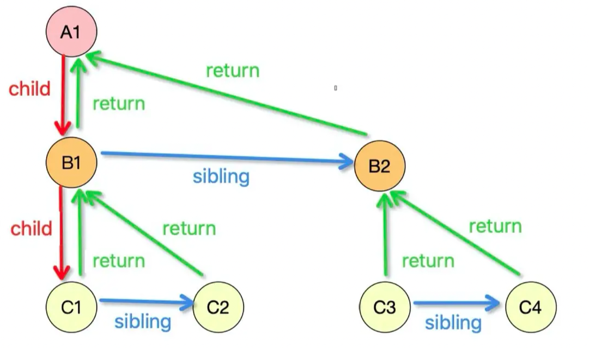

# React Fiber

## 原理

- **Fiber 架构：** 重新设计了协调引擎，以 Fiber 节点作为基本单位来表示组件，构建组件树，每个 Fiber 节点存储了组件的状态、属性等信息

  > Fiber 节点是构建 Fiber 树的基本单元，具有以下关键属性：
    > 1. **type 和 key：** type 属性表示组件类型，可以是字符串（原生标签）或函数/类组件,key 用于区分和重用 Fiber 节点
    > 2. **stateNode：** stateNode 属性保存组件实例、DOM 节点或其他 React 元素的引用
    > 3. **child、sibling 和 return：** 定义了 Fiber 树的结构，child 指向第一个子节点，sibling 指向下一个兄弟节点，return 指向父节点

     

- **增量渲染：** 允许将渲染任务切分成多个小任务，可以在多帧中逐步完成，增加了浏览器的渲染间隙，提高了响应性

- **任务优先级调度：** 引入任务优先级的概念，调度器根据任务的优先级来决定任务的执行顺序，优先处理重要任务，保证应用的可响应性

- **协调过程和双缓存技术：** 使用重新设计的协调过程，比较前后两次渲染的差异，生成更新任务而双缓存技术确保渲染和协调工作的平滑切换

- **Diff 算法优化：** 改进 Diff 算法，更精确地计算出需要更新的组件，减少不必要的更新操作，提升性能

### 执行原理

执行过程分为两个阶段：render 阶段和 commit 阶段。

#### Render 阶段

1. 构建 Fiber Tree：从根节点开始，将虚拟 DOM 树转换为 Fiber 树。每个 Fiber 节点包含任务和节点变更信息。

2. 可中断遍历：采用后序遍历，遍历 Fiber 树，处理子节点、兄弟节点，然后返回父节点

   > 遍历流程：后序遍历方法
   
   

3. 生成 Effect List：根据遍历过程中的节点变更，生成 effect list，记录节点的新增、更新、删除等变更。

#### Commit 阶段

1. 不可中断操作：在 commit 阶段，执行 effect list 中的任务，对 DOM 进行一次性的更新。

2. 根据 Effect List 更新视图：根据 effect list，执行相应的操作，如新增节点、删除节点和更新节点等。

3. 完成更新：通过一次性操作，将之前在 render 阶段计算的所有变更一次性应用到 DOM 上。

通过 Render 阶段构建 Fiber Tree 并计算 Effect List，然后通过 Commit 阶段将变更应用到 DOM，React Fiber 实现了高度可控和增量渲染，保证了用户界面的响应性和流畅性。这个执行原理使得 React 能够在不阻塞主线程的情况下更高效地处理大型和复杂的应用。

## 主要工作流程

1. **构建 Fiber 树：** 将组件树表示为一系列 Fiber 节点，每个节点包含组件的信息，通过这些节点构建 Fiber 树

2. **协调过程：** 当数据变化时， 比较前后两次渲染的差异，生成更新任务

3. **任务调度和优先级：** 调度器根据任务的优先级决定任务的执行顺序，高优先级的任务会优先执行

4. **增量渲染和中断：** 渲染过程可以被中断和恢复，使得渲染任务可以分成多个小任务

5. **DOM 更新：** 执行生成的更新任务，更新虚拟 DOM 树，然后通过 Diff 算法计算出需要更新的部分

6. **副作用处理：** 调用生命周期函数，处理副作用，更新真实的 DOM，触发页面渲染

## 作用

1. **提高渲染性能：** 增量渲染、任务优先级和异步渲染等特性，显著提高 React 应用的渲染性能，使应用更具响应性。

2. **优化用户体验：** 引入任务优先级和挂起恢复等机制，能够更好地响应用户交互，保持流畅的用户体验

3. **支持大型应用：** 适用于处理大型、复杂的用户界面，通过分片和任务调度来降低单次渲染任务的复杂性

4. **减少不必要的渲染：** 通过优化的 Diff 算法，更准确地计算出需要更新的组件，从而减少不必要的 DOM 操作

### 副作用

- **生命周期函数调用频率变化：** 由于增量渲染，一些生命周期函数可能会被多次调用。需要注意避免在 `shouldComponentUpdate`、已废弃钩子（如 `componentWillMount`）、以及不稳定钩子（如 `componentWillReceiveProps`）中出现副作用

- **任务的中断和恢复：** Fiber 允许在渲染过程中中断任务并恢复其他任务，这可能会影响到一些需要连续执行的逻辑，需要在编写代码时考虑任务被中断和恢复的情况
