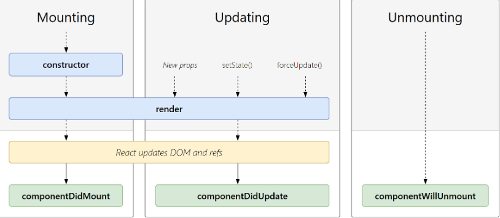

# 生命周期

## 组件的生命周期

- 三个状态
  Mounting(挂载)：已插入真实 DOM
  Updating(更新)：正在被重新渲染
  Unmounting(卸载)：已移出真实 DOM

在 React 中，组件的生命周期是指组件从被创建到被销毁的整个过程中，React 提供了一系列的生命周期方法，允许你在不同的阶段执行特定的操作。然而，随着 React 16.3 版本的发布，部分生命周期方法被弃用，取而代之的是新的生命周期方法和钩子函数。以下是 React 组件的生命周期方法，按照它们被调用的顺序进行说明：

**挂载阶段（Mounting Phase）**：

1. **constructor(props)**：组件的构造函数，在组件被创建时调用，用于初始化状态和绑定方法。

2. **static getDerivedStateFromProps(props, state)**：这个静态方法在组件实例化时和每次更新时都会被调用。它接收新的 props 和当前的 state 作为参数，返回一个对象来更新 state，或者返回 null 来表示不需要更新。

3. **render()**：这是渲染方法，返回一个 React 元素。它是类组件唯一必须实现的方法。

4. **componentDidMount()**：在组件挂载到 DOM 后立即调用。通常用于执行副作用，比如数据获取、订阅等操作。

**更新阶段（Updating Phase）**：

1. **static getDerivedStateFromProps(props, state)**：同样在更新阶段也会调用，功能与挂载阶段一致。

2. **shouldComponentUpdate(nextProps, nextState)**：在更新发生前被调用，用于判断是否需要重新渲染组件，默认返回 true。通过比较新旧 props 和 state，可以进行性能优化。

3. **render()**：同挂载阶段。

4. **getSnapshotBeforeUpdate(prevProps, prevState)**：在 render 之后、更新实际渲染之前调用。可以在这里获取 DOM 元素的信息，通常用于处理滚动位置等。

5. **componentDidUpdate(prevProps, prevState, snapshot)**：在组件更新后被调用。通常用于处理更新后的副作用，例如数据更新后的操作。

**卸载阶段（Unmounting Phase）**：

1. **componentWillUnmount()**：在组件即将被销毁时调用。用于执行清理操作，比如取消订阅、定时器的清理等。

**错误处理阶段（Error Handling Phase）**：

1. **static getDerivedStateFromError(error)**：在子组件抛出错误时调用，返回一个用于更新 state 的对象。

2. **componentDidCatch(error, info)**：在子组件抛出错误后调用，用于记录错误信息或发送错误报告。



## 具体

当组件实例被创建并插入 DOM 中时，其生命周期调用顺序如下：

- **constructor()**：在 React 组件挂载之前，会调用它的构造函数。这是初始化组件状态和绑定方法的地方。

- **getDerivedStateFromProps()**：在调用 render 方法之前调用，并且在初始挂载及后续更新时都会被调用。可以根据传入的 props 更新组件的 state。

- **render()**：render() 方法是 class 组件中唯一必须实现的方法。它返回一个 React 元素，描述了在屏幕上看到的内容。

- **componentDidMount()**：在组件挂载后（插入 DOM 树中）立即调用。通常用于执行一次性的副作用操作，如数据获取。

这些方法的详细说明，可以参考官方文档。

---

每当组件的 state 或 props 发生变化时，组件就会更新。

当组件的 props 或 state 发生变化时，组件更新的生命周期调用顺序如下：

- **getDerivedStateFromProps()**：在调用 render 方法之前调用，并且在初始挂载及后续更新时都会被调用。它在更新发生前允许你根据新的 props 来更新 state。

- **shouldComponentUpdate()**：当 props 或 state 发生变化时，shouldComponentUpdate() 会在渲染执行之前被调用。可以通过返回 true 或 false 来控制是否需要重新渲染组件。

- **render()**：render() 方法是 class 组件中唯一必须实现的方法。它负责根据当前的 props 和 state 返回一个 React 元素。

- **getSnapshotBeforeUpdate()**：在最近一次渲染输出（提交到 DOM 节点）之前调用。通常在组件更新前需要获取 DOM 信息时使用。

- **componentDidUpdate()**：在更新后会被立即调用。通常用于处理更新后的副作用，比如更新后的数据获取。

这些方法的详细说明，可以参考官方文档。

---

当组件从 DOM 中移除时会调用如下方法：

- **componentWillUnmount()**：在组件即将被销毁及卸载之前直接调用。通常用于执行一些清理操作，比如取消订阅或清除定时器。

总结而言，上述生命周期方法依次描述了组件的创建、更新和卸载过程，每个方法都在特定的阶段被调用。在 React 16.3 版本之后，部分生命周期方法被弃用，新的生命周期方法和钩子函数被引入。务必参考官方文档以获取更详细和最新的信息。

## 说明

```ts
import React, { useState, useEffect } from "react";

const FunctionComponentExample = (props) => {
  // 使用 useState 钩子来管理状态
  const [count, setCount] = useState(0);

  // 相当于 componentDidMount 和 componentDidUpdate
  useEffect(() => {
    console.log("组件已经挂载或更新。");

    // 返回的函数将在组件即将卸载时执行
    return () => {
      console.log("组件即将被销毁。");
    };
  }, []); // 第二个参数是空数组，表示只在挂载和卸载时执行

  // 自定义方法，用于增加计数
  const incrementCount = () => {
    setCount(count + 1);
  };

  // 渲染组件内容
  return (
    <div>
      <h1>Hello, {props.name}!</h1>
      <p>当前计数：{count}</p>
      <button onClick={incrementCount}>增加计数</button>
    </div>
  );
};

export default FunctionComponentExample;
```
